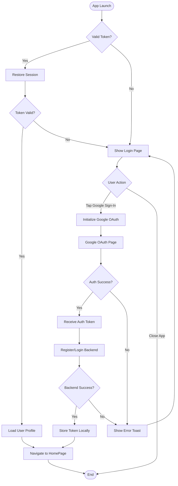
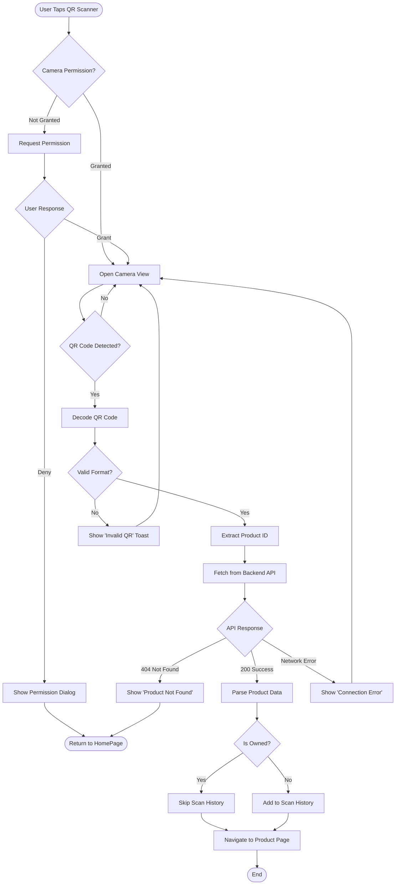
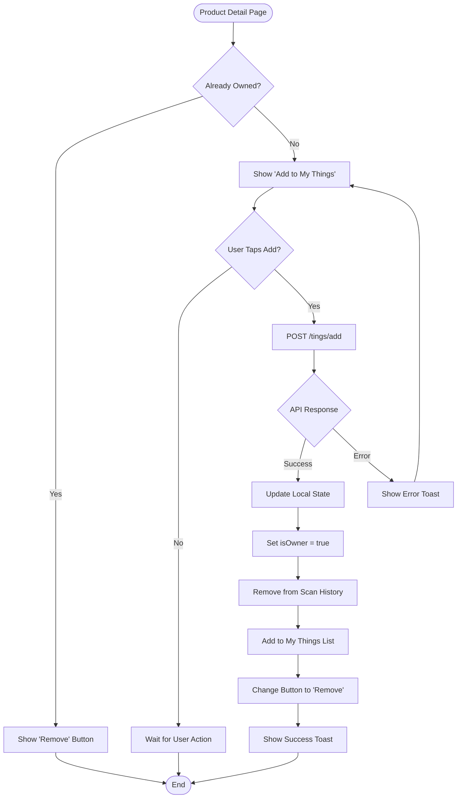
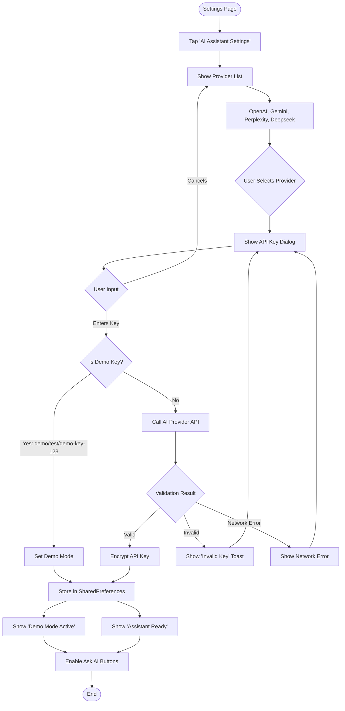
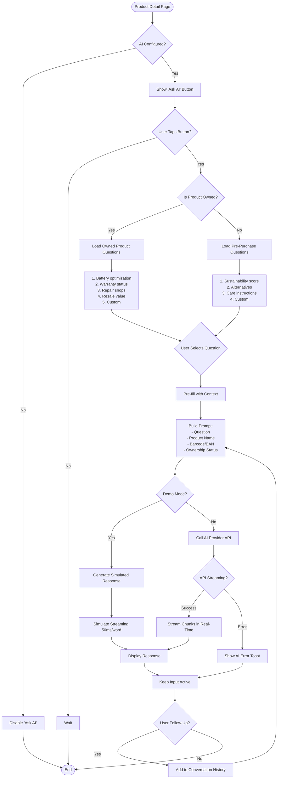
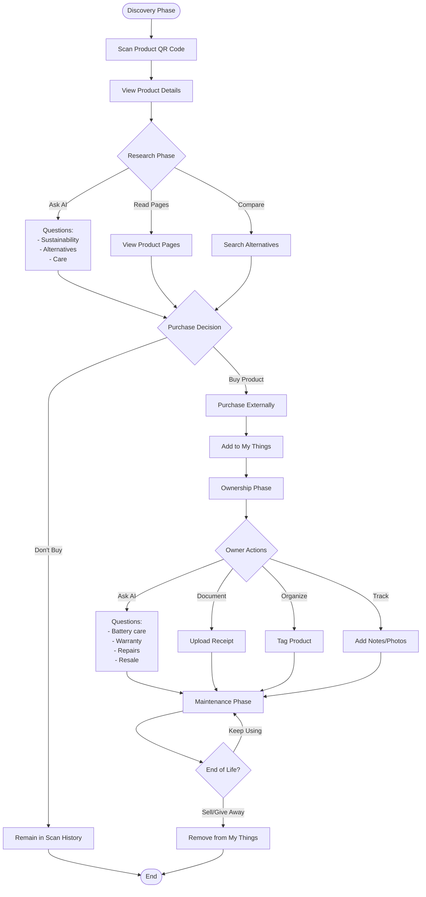
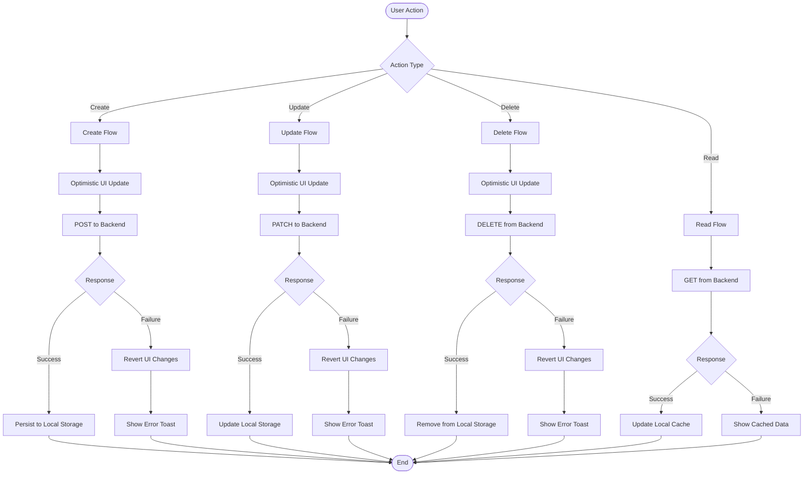
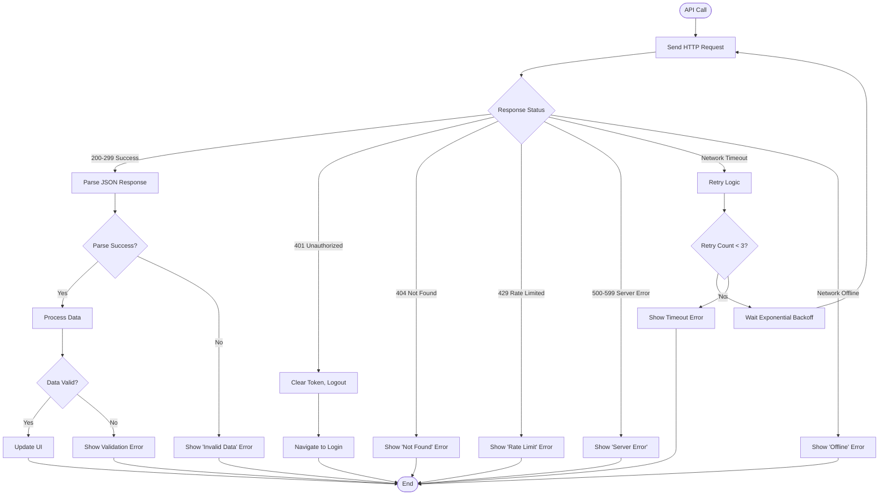
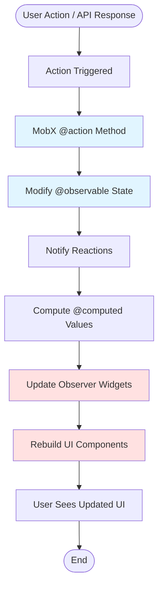
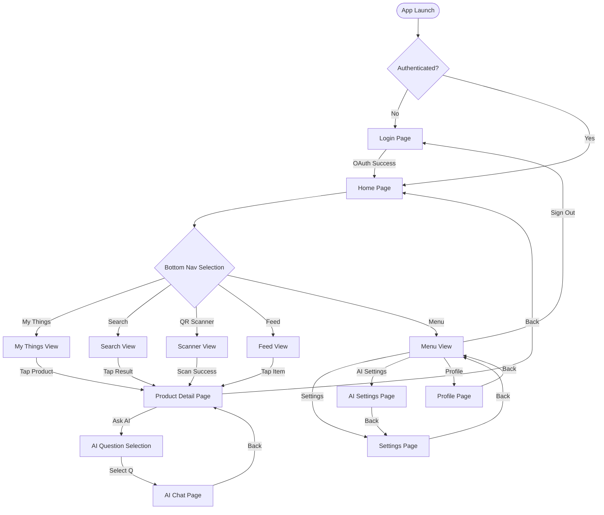

# Process Flow Diagrams
## Thap Mobile Application

**Version:** 2.0  
**Date:** November 18, 2025  
**Format:** Text-based flowcharts (Mermaid-compatible)

---

## 1. User Authentication Flow

**Key Decision Points:**
1. Token validation determines auto-login
2. OAuth success/failure determines next steps
3. Backend registration can fail independently

---

## 2. Product Scanning Flow

**Key Decision Points:**
1. Camera permission is critical path
2. QR validation happens before API call
3. Ownership status determines history tracking

---

## 3. Add Product to Wallet Flow

**Key Decision Points:**
1. Ownership check determines button state
2. API success required before UI update
3. Local state update is atomic operation

---

## 4. AI Assistant Configuration Flow

**Key Decision Points:**
1. Demo key detection bypasses validation
2. Real API validation required for production
3. Encryption before storage

---

## 5. Ask AI Conversation Flow

**Key Decision Points:**
1. AI configuration check gates feature
2. Ownership status determines question templates
3. Demo mode provides simulated responses
4. Conversation history maintained for context

---

## 6. Product Lifecycle Flow

**Key Phases:**
1. Discovery → Research → Decision
2. Ownership → Documentation → Maintenance
3. End of Life → Removal

---

## 7. Data Synchronization Flow

**Synchronization Strategy:**
1. Optimistic UI updates (instant feedback)
2. Backend call (source of truth)
3. Local persistence (offline support)
4. Rollback on failure

---

## 8. Error Handling Flow

**Error Categories:**
1. Authentication errors → Logout
2. Client errors (4xx) → User notification
3. Server errors (5xx) → Retry or notify
4. Network errors → Retry with backoff

---

## 9. State Management Flow (MobX)

**MobX Flow:**
1. Actions modify observable state
2. Computed values auto-recalculate
3. Observers (widgets) auto-rebuild
4. UI reflects state changes

---

## 10. Navigation Flow

**Navigation Hierarchy:**
- Root: LoginPage or HomePage
- Main: 5 bottom navigation tabs
- Sub: Product details, settings, AI chat
- Modal: Dialogs, confirmations

---

## Summary

**Total Flows:** 10
- Authentication: 1
- Product Operations: 3
- AI Features: 2
- Data Sync: 1
- Error Handling: 1
- State Management: 1
- Navigation: 1

**Key Patterns:**
- Optimistic UI updates
- Exponential backoff retry
- State-driven UI (MobX)
- Navigation stack management
